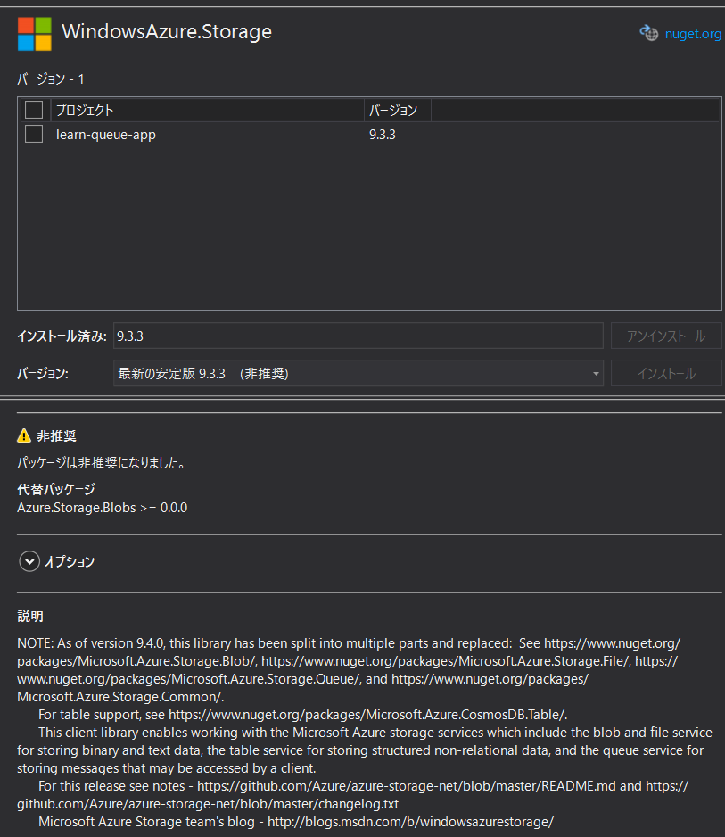

# learn-communicate-between-apps-with-azure-queue-storage

https://docs.microsoft.com/ja-jp/learn/modules/communicate-between-apps-with-azure-queue-storage/

## 環境設定

Azure CLI で作業します。  

[Azure CLI の概要 Microsoft Docs](https://docs.microsoft.com/ja-jp/cli/azure/?view=azure-cli-latest)  

### Azure にログイン

```powershell
az login
```

ブラウザから Azure Portal にログインします。  

### ストレージアカウント作成

```powerhsell
az storage account create --name <storage-resource-name> -g <resource-group-name> --kind StorageV2 --sku Standard_LRS
```

``<storage-resource-name>``: 作成するストレージの名前を指定してください（名前に記号は使えません）、グローバルで一意の名前です。  
``<resource-group-name>``: 既存の作成済みのリソースグループ名を指定してください。  


### ストレージアカウントの接続文字列の取得

```powerhsell
az storage account show-connection-string --name <storage-resource-name> --resource-group <resource-group-name>
```

引数の値は作成時と同じです。


### ストレージアカウントのキューメッセージの参照

```pwershell
az storage message peek --queue-name <storage-resource-name> --connection-string "<connection-string>"
```

``<storage-resource-name>``: 作成したストレージの名前を指定してください。  
``<connection-string>``:  前項のストレージアカウントの接続文字列の取得結果の接続文字列、値はダブルクウォートで囲ってください。  


## 特記事項

* 利用する nuget パッケージが非推奨になっていますので置き換えてください。  

:x: ``dotnet add package Microsoft.Azure.Storage.Queue``:  
  


↓    

* [NuGet Gallery | Microsoft.Azure.Storage.Queue 11.2.0](https://www.nuget.org/packages/Microsoft.Azure.Storage.Queue/11.2.0?_src=template)

:heavy_check_mark: ``dotnet add package Microsoft.Azure.Storage.Queue``:  
（必要に応じて引数にバージョンを付与してください。）  

```powershell
dotnet add package Microsoft.Azure.Storage.Queue
```


* 利用する nuget パッケージを変更した場合、using も置き換えてください。  
（``using System.Threading.Tasks;`` はそのままで問題無いです。）    

:x: ``変更前 : ``

```csharp
using Microsoft.WindowsAzure.Storage;
using Microsoft.WindowsAzure.Storage.Queue;
```

↓    

:heavy_check_mark: ``変更後 : ``

```csharp
using Microsoft.Azure.Storage;
using Microsoft.Azure.Storage.Queue;
```


* ソリューションファイルに言語（C#） のバージョンを指定について

説明では次のように TargetFramework に C# 7.1 を指定していますが、.NET Core 3.1 の場合、この作業は不要です。  
（説明のプロジェクトでは .NET Core 2.2 系の為、言語バージョンの指定が必要となっています。）  

```xml
<Project Sdk="Microsoft.NET.Sdk">

  <PropertyGroup>
    <OutputType>Exe</OutputType>
    <TargetFramework>netcoreapp2.2</TargetFramework>
    <LangVersion>7.1</LangVersion> 
  </PropertyGroup>
...
```

VisualStudio 2019 で .NET Core（コンソールアプリ）を作成した場合はデフォルトで .NET Core 3.1 が選択されます。  

```xml
<Project Sdk="Microsoft.NET.Sdk">

  <PropertyGroup>
    <OutputType>Exe</OutputType>
    <TargetFramework>netcoreapp3.1</TargetFramework>
    <RootNamespace>learn_queue_app</RootNamespace>
  </PropertyGroup>
...
```


